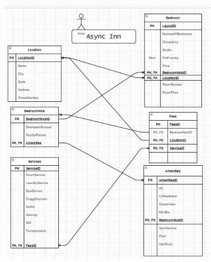

# Lab 11 - Relational Databases

The owners of “Async Inn” are looking for a RESTful API server that will allow them to better manage the assets in their hotels. They are anticipating the ability to modify and manage rooms, amenities, and new hotel locations as they are built.

This is a first draft at creating a system design of a database ERD diagram that meets all of the requirements below. The diagram should take all of the requirements into consideration and allow a baseline for starting the creation of the web application.

The hotel is named “Async Inn” and has many nationwide locations. Each location will have a name, city, state, address, and phone number.

A LOCATIONS table was created with a primary key relationship to the FEES  and BEDROOM tables forein keys in order to model a many to one relationship. One location can have many bedrooms and fees.

A BEDROOM table was created with a foreign key relationship to the location tables primary key in order to model a many to one relationship. One location can have many bedrooms.  Similar room types (2 beds) can have different nicknames, we also utilized the one to many relationship between BEDROOM and BedroomNICK.

The AMENITIES table consists of amenities that each room provides based on room nickname and amenities shared by all guests. (We forgot the ForeignKey for the LOCATIONS table.)

The SERVICES table is a list of services that the hotel will provide for a fee with a many to many relationship to the FEE table.

The FEE table brings everything together, with pricing based on LOCATION, BedroomNICK, and SERVICES provided. The FEE table has a many to many relationship with those table listed.
